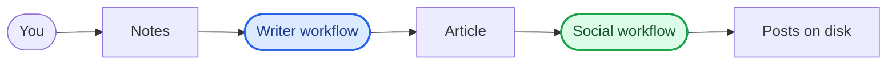

# Agentic writer

Agentic writer is a Mastra-powered content pipeline: write an article from operating instructions (and an optional author draft), then generate social posts — with human approval on articles before promotion.



> **Cost disclaimer:** I am not responsible for unexpected costs when using these agents and workflows.

## Getting Started

Set your API keys in `.env`:

```shell
cp .env.example .env
# then edit .env and set OPENAI_API_KEY and DEEPSEEK_API_KEY
```

> Models are tiered for cost vs quality in `src/mastra/config/models.ts`. Override any agent via env for A/B testing — see [docs/agents.md#ab-testing-model-overrides](docs/agents.md#ab-testing-model-overrides).
>


Customize the pipeline for yourself (gitignored, local only):

```shell
cp src/mastra/config/user-profile.local.example.json src/mastra/config/user-profile.local.json
# edit name, mission, audience, voice, and goals
```

If `user-profile.local.json` is missing, the committed example profile (`Marty McFly`) is used.

Approved articles are saved under `data/articles/<article-id>/` (gitignored), with numbered drafts and editor reviews kept alongside `approved.md`. Social campaigns are written under each article's `social/` folder. The social media workflow shows approved articles in an **article** dropdown after you run the article workflow.

Start the development server:

```shell
npm run dev
```

Open [http://localhost:4111](http://localhost:4111) in Studio: run `articleWorkflow` with your notes (and optional author draft), then `socialMediaWorkflow` — pick a saved article from the dropdown and choose target platforms.

Or drive the same pipelines from an MCP client while the server is running — see [docs/mcp.md](docs/mcp.md) (`http://localhost:4111/api/mcp/agentic-writer/mcp`).

You can start editing files inside the `src/mastra` directory. The development server will automatically reload whenever you make changes.

## Workflows

| Workflow | Description |
|----------|-------------|
| Article workflow | Turns author operating instructions (and an optional author draft) into a researched, written, and human-approved Markdown article. |
| Social media workflow | Turns the approved Markdown article into platform-native posts and a hero image, saved to disk under the article folder. |

See [docs/workflows.md](docs/workflows.md) for steps, inputs/outputs, and integration details.

## MCP

While `npm run dev` is running, an MCP server exposes start/list/approve tools for articles and social campaigns at `http://localhost:4111/api/mcp/agentic-writer/mcp`. See [docs/mcp.md](docs/mcp.md).

## Agents

Six specialized agents power the two workflows. Each agent's tone and personality is centralized in `src/mastra/config/personalities.ts` so it can be tuned project-wide without touching the agent definitions.

| Agent | Model | Description |
|-------|-------|-------------|
| Researcher | `deepseek/deepseek-v4-flash` | Extracts topics from operating instructions; when instructions include URLs, fetches those sources only; otherwise searches the web. Produces a research brief for the Writer. |
| Writer | `openai/gpt-5` | Drafts and revises the article from the research brief and instructions; develops an optional author draft. |
| Editor | `openai/gpt-5-mini` | Reviews each draft against instruction intent, research, and optional author draft; recommends approval or another writing pass. |
| Strategist | `openai/gpt-5-nano` | Decides per-platform publication strategy — hook, call to action, and timing — for a social campaign. |
| Content Creator | `openai/gpt-5-mini` | Writes platform-native posts from the article and a creative brief for the hero image; optionally shortens a publish URL via Dub. |
| Graphic Designer | `openai/gpt-4.1-nano` | Executes the Content Creator's creative brief into one on-brand hero image. |

See [docs/agents.md](docs/agents.md) for models, tools, full instructions, and personality details.

See [docs/observability-memory-and-token-limiter.md](docs/observability-memory-and-token-limiter.md) for observability, observational memory, and input token limiting.

See [docs/customization.md](docs/customization.md) for local profile and article storage.

---

This tool is developed with [Mastra](https://mastra.ai/), an open-source TypeScript framework for building AI agents and workflows.
