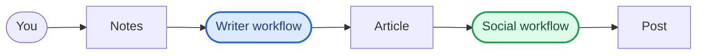

# Agentic writer

Agentic writer is a Mastra-powered content pipeline: write an article from notes, then promote it on social media — with human approval at each stage.



## Getting Started

Set your OpenAI key in `.env`:

```shell
cp .env.example .env
# then edit .env and set OPENAI_API_KEY
```

> This project uses OpenAI models by default. Feel free to swap in your preferred model for each agent in `src/mastra/agents/`.

Customize the pipeline for yourself (gitignored, local only):

```shell
cp src/mastra/config/user-profile.local.example.ts src/mastra/config/user-profile.local.ts
# edit name, mission, audience, voice, and goals
```

Approved articles are saved to `data/articles/` (also gitignored). The social media workflow shows them in an **article** dropdown after you run the article workflow.

Start the development server:

```shell
npm run dev
```

Open [http://localhost:4111](http://localhost:4111) in Studio: run `articleWorkflow` with your notes, then `socialMediaWorkflow` — pick a saved article from the dropdown and choose target platforms.

You can start editing files inside the `src/mastra` directory. The development server will automatically reload whenever you make changes.

## Workflows

| Workflow | Description |
|----------|-------------|
| Article workflow | Turns raw author notes into a researched, written, and human-approved MDX article. |
| Social media workflow | Turns the approved MDX article into a platform-native social campaign scheduled via Buffer. |

See [docs/workflows.md](docs/workflows.md) for steps, inputs/outputs, and integration details.

## Agents

Six specialized agents power the two workflows. Each agent's tone and personality is centralized in `src/mastra/config/personalities.ts` so it can be tuned project-wide without touching the agent definitions.

| Agent | Description |
|-------|-------------|
| Researcher | Extracts topics from author notes, searches the web, and produces a research brief for the Writer. |
| Writer | Drafts and revises the article as MDX from the research brief, notes, and editorial feedback. |
| Editor | Reviews each draft against the notes and research brief, and recommends approval or another writing pass. |
| Strategist | Decides per-platform publication strategy — hook, call to action, and timing — for a social campaign. |
| Content Creator | Writes platform-native posts from MDX, optionally shortens a publish URL via Dub, and schedules via Buffer. |
| Graphic Designer | Executes the Content Creator's creative brief into one on-brand hero image. |

See [docs/agents.md](docs/agents.md) for models, tools, full instructions, and personality details.

See [docs/observability-memory-and-token-limiter.md](docs/observability-memory-and-token-limiter.md) for observability, observational memory, and input token limiting.

See [docs/customization.md](docs/customization.md) for local profile and article storage.

---

This tool is developed with [Mastra](https://mastra.ai/), an open-source TypeScript framework for building AI agents and workflows.
