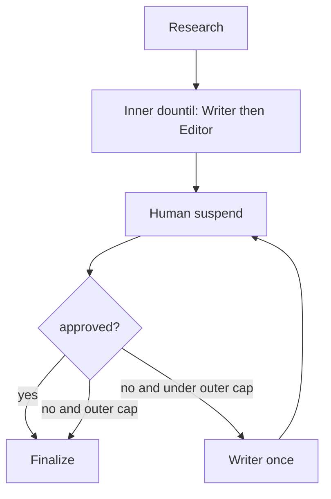

# Writer–Editor polish loop (before human approval)

## Summary

Split the article workflow into two nested Mastra workflow loops:

1. **Inner (editor polish):** Writer → Editor, up to 3 cycles, stopping early when Editor returns `ready: true`.
2. **Outer (human approval):** Suspend for human review; on reject, Writer revises once (no Editor), then suspend again — up to 10 cycles.

This is a **workflow loop**, not an agent loop. Writer and Editor remain step-scoped agents; stop conditions are deterministic.

## Decisions

| Topic | Decision |
|-------|----------|
| Inner cap | Up to 3 Writer→Editor cycles; stop when `ready === true` |
| Cap with `ready: false` | Still suspend for human with latest draft + last review |
| Human approve | Always finalizes (overrides Editor) |
| Human reject | Writer once, skip Editor, suspend again |
| Editor guidance (inner) | Cumulative reviews appended to `guidanceNotes` |
| Human reject guidance | Append human notes to accumulated editor reviews; human wins on conflict |
| Outer cap | 10 human reject→Writer→suspend cycles → `max_iterations_reached` |
| Suspend payload | Add `editorReady`, `editorPassCount` |
| After human-only revise | Keep stale last Editor review / ready / passCount (Editor did not re-check) |
| Editor signal | Structured `{ ready: boolean, review: string }` via `structuredOutput` |

## Flow

## State

Extend `draftStateSchema` with:

- `editorReady: boolean`
- `editorPassCount: number`
- `guidanceNotes: string` — cumulative editor reviews and human notes

## Files

- `src/mastra/workflows/article-workflow.ts` — nested loops, structured Editor output
- `src/mastra/agents/editor-agent.ts` — instructions for automatic polish vs human handoff
- `src/mastra/lib/writer-prompts.ts` — guidance append helper, human-priority note
- `src/mastra/tools/writer-mcp-tools.ts` — suspend payload fields
- Docs: `docs/workflows.md`, `docs/mcp.md`, `docs/agents.md`, `README.md`

## Out of scope

- Re-running Editor after human reject
- Changing research or finalize behavior
- Single-agent orchestrator loop
