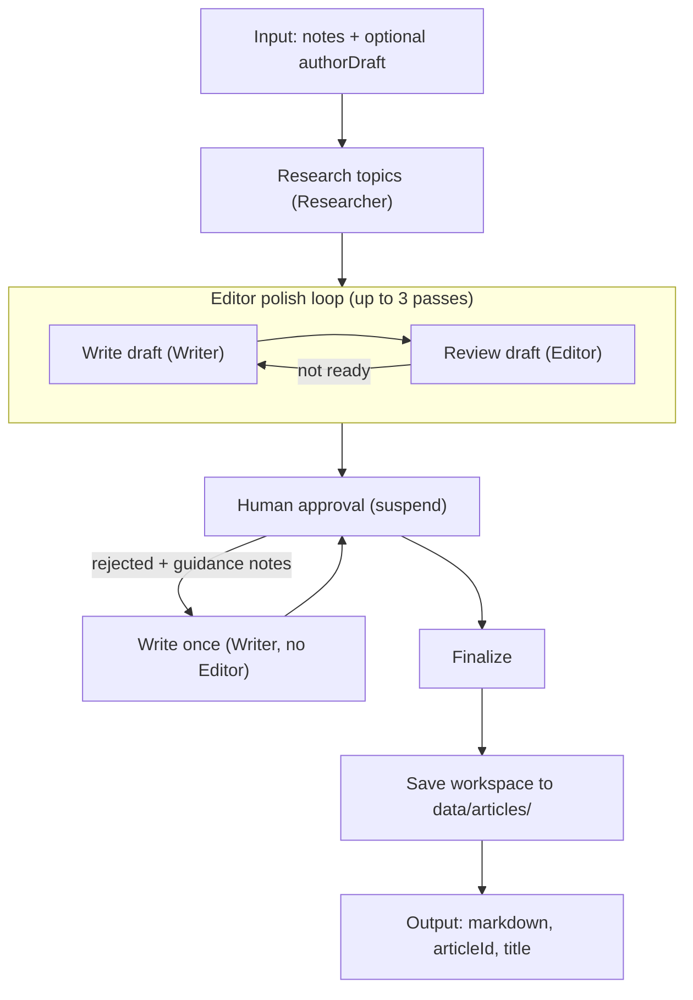
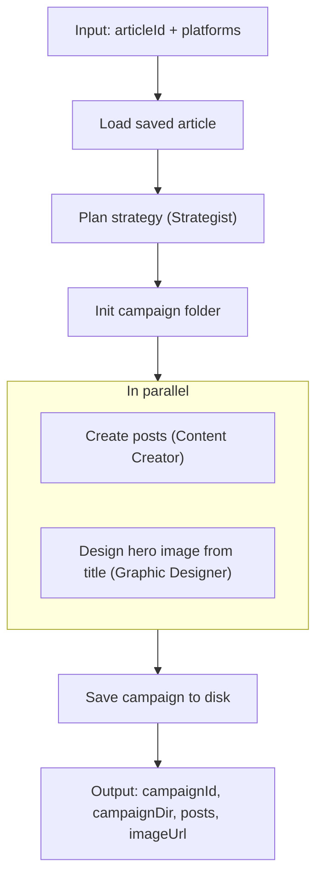

# Workflows

Two Mastra workflows orchestrate the agents. Run the article workflow first, then feed its Markdown output into the social media workflow. Source files live in `src/mastra/workflows/`.

You can also start and resume these workflows (and read articles/campaigns) via the MCP server — see [mcp.md](mcp.md).

| Workflow | ID | Source |
|----------|-----|--------|
| Article workflow | `article-workflow` | `src/mastra/workflows/article-workflow.ts` |
| Social media workflow | `social-media-workflow` | `src/mastra/workflows/social-media-workflow.ts` |

## Article workflow

The `articleWorkflow` turns author operating instructions (`notes`) and an optional author draft into a human-approved Markdown article.

### Steps

1. **Research** — if the operating instructions contain URLs, the workflow fetches each page and the Researcher summarizes only that material (no web search). Otherwise the Researcher extracts topics from the instructions and researches them online (including social media/forums). Notes are treated as instructions, not article body.
2. **Editor polish** — the Writer drafts (or revises) the article; the Editor returns structured `{ ready, review }`. The loop repeats until `ready === true` or three Writer→Editor passes complete. Editor reviews accumulate as revision guidance for the Writer. When the cap is hit with `ready: false`, the workflow still proceeds to human review with the latest draft and last editor review.
3. **Approve** — the workflow suspends for human approval; the human approves or rejects with additional operating instructions. Human approval always finalizes, even when the Editor marked the draft not ready.
4. **Human revision** — on reject, the Writer revises once from human notes plus accumulated editor reviews (human notes win on conflict). The Editor does not re-check; suspend payload keeps the last editor review and pass metadata as stale context.
5. Steps 3–4 repeat until the human approves — or until 10 human revision cycles, in which case the latest draft is finalized with `completionReason: "max_iterations_reached"` so work is not discarded.
6. The approved draft is saved as `approved.md` inside a per-run article folder under `data/articles/`, with numbered drafts and editor reviews preserved in `drafts/`. Resume suspended runs in Studio to continue reviewing an in-progress article later.

### Article workspace

Each workflow run creates a folder (snake_case title + short id). Files are written incrementally:

| When | Written |
|------|---------|
| Research done | `notes.md`, `author-draft.md` (only if provided), `research-brief.md`, `article.json` |
| Writer done | `drafts/00N.md` (clean H1; revision via filename and `article.json` `currentDraft`) |
| Editor done | `drafts/00N.editor-review.md` |
| Human rejects | `drafts/00N.human-notes.md`, status → `in_progress` |
| Human approves | `approved.md`, status → `approved` |

While status is `awaiting_review`, resume the suspended workflow run in Studio. See [customization.md](customization.md) for the full folder layout.

### Input and output

**Input:** `{ notes: string, authorDraft?: string }`

- `notes` — operating instructions (article type, topics, sources/URLs, constraints). Never article body.
- `authorDraft` — optional author-written prose or outline that belongs in the article.

**Output:** `{ markdown: string, articleId: string, title: string, completionReason: "approved" | "max_iterations_reached" }`

When instructions include source URLs, each URL is fetched with SSRF guards (http/https only, private/link-local IPs blocked, redirect re-check, 10s timeout, 2MB size cap).

### Agents

Researcher → Writer ↔ Editor (automatic polish, up to 3 passes) → human approval loop (Writer-only on reject, up to 10 cycles).

## Social media workflow

The `socialMediaWorkflow` loads a saved article from `data/articles/` and saves a social campaign to disk.

### Steps

1. **Load** — reads the selected article from `data/articles/` (dropdown in Studio).
2. **Strategize** — the Strategist decides a publication strategy: a hook/angle, call to action, and timing guidance for each requested platform.
3. **Init campaign** — creates the campaign folder under the article so the hero image can be saved while posts are written.
4. **Create + Design (parallel)** — the Content Creator writes a platform-native post for every requested platform; at the same time the Graphic Designer creates one on-brand hero image from the **article title only** (simple schematic figures allowed; no text labels). Image generation does not use article body or post copy.
5. **Save** — writes the campaign under `data/articles/{articleId}/social/{campaignId}/` (posts, strategy, title-based image brief, hero image metadata). No human approval step; review and publish manually from disk.

### Input and output

**Input:** `{ articleId: string, platforms: string[], articleUrl?: string }` (see `SUPPORTED_PLATFORMS` in `src/mastra/config/platforms.ts`)

- `articleId` — saved article from `data/articles/` (Studio dropdown; run the article workflow first)
- `platforms` — target social platforms
- `articleUrl` (optional) — published URL for post CTAs; shortened via Dub when `DUB_API_KEY` is set

**Output:** `{ campaignId: string, campaignDir: string, posts: Array<{ platform, text, hashtags? }>, imageUrl?: string }`

### Environment and integrations

- **`PUBLIC_BASE_URL`** — base URL for locally generated hero images. Defaults to `http://localhost:4111`.
- **`DUB_API_KEY`** (optional) — when `articleUrl` is provided, the `prepare-article` step shortens it deterministically via [Dub's](https://dub.co) link upsert API before the Strategist or Content Creator see it, so posts always carry the short link. On API failure the workflow falls back to the original URL.

### Who this content is for

All agents read your profile from `src/mastra/config/user-profile.local.json` when present (see [customization.md](customization.md)).

### Agents

Strategist → init campaign → Content Creator ∥ Graphic Designer → save to disk.
