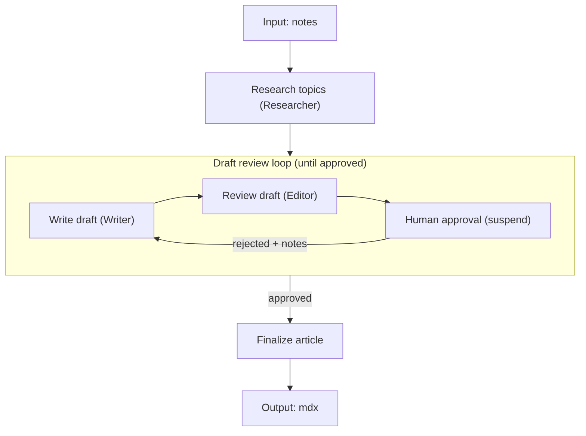
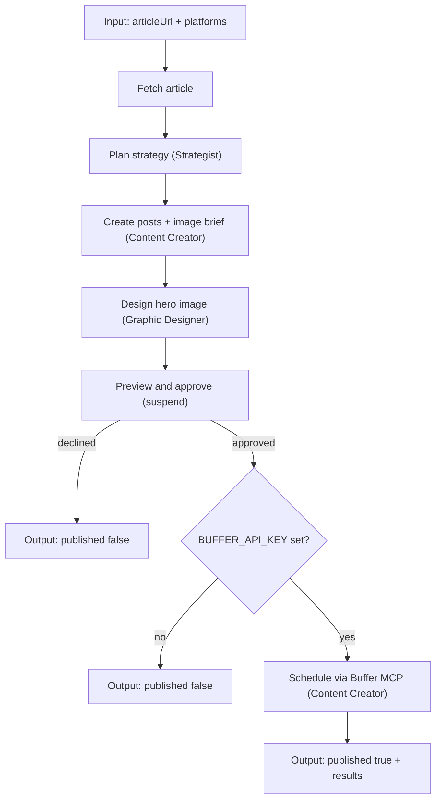

# Workflows

Two Mastra workflows orchestrate the agents. Source files live in `src/mastra/workflows/`.

| Workflow | ID | Source |
|----------|-----|--------|
| Article workflow | `article-workflow` | `src/mastra/workflows/article-workflow.ts` |
| Social media workflow | `social-media-workflow` | `src/mastra/workflows/social-media-workflow.ts` |

## Article workflow

The `articleWorkflow` turns raw author notes into a human-approved MDX article.

### Steps

1. **Research** — the Researcher extracts topics from the notes and researches them online (including social media/forums).
2. **Write** — the Writer drafts the article as MDX from the research brief.
3. **Review** — the Editor reviews the draft against the notes and research.
4. **Approve** — the workflow suspends for human approval; the human approves or rejects with additional notes.
5. Steps 2–4 repeat, feeding the editor's review and the human's notes back to the Writer, until the human approves.
6. The approved draft is returned as MDX text.

### Input and output

**Input:** `{ notes: string }`

**Output:** `{ mdx: string }`

### Agents

Researcher → Writer → Editor (looping until human approval).

## Social media workflow

The `socialMediaWorkflow` turns an article link into a human-approved social media campaign.

### Steps

1. **Read** — the article at the submitted URL is fetched and its readable text extracted.
2. **Strategize** — the Strategist decides a publication strategy: a hook/angle, call to action, and timing guidance for each requested platform.
3. **Create** — the Content Creator writes a platform-native post for every requested platform and a creative brief (subject, mood, composition) for the hero image.
4. **Design** — the Graphic Designer executes that brief into one on-brand hero image, applying the fixed brand visual style in `src/mastra/config/visual-style.ts` regardless of the brief's wording.
5. **Preview & approve** — the workflow suspends and shows the human the drafted posts and image; the human approves, optionally limiting to a subset of platforms, or declines and the workflow ends without publishing.
6. **Publish** — on approval, the Content Creator connects to Buffer via MCP, matches each platform to a connected Buffer channel, and adds the post to that channel's queue (skipping platforms with no connected channel).

### Input and output

**Input:** `{ articleUrl: string, platforms: string[] }` (see `SUPPORTED_PLATFORMS` in `src/mastra/config/platforms.ts`)

**Output:** `{ published: boolean, reason?: string, results?: Array<{ platform, status, detail? }> }`

### Environment and integrations

- **`BUFFER_API_KEY`** (see `.env.example`) — required to schedule posts. Without it, the workflow still runs through strategy, content creation, and preview, then ends with `published: false` at the approval step.
- **`PUBLIC_BASE_URL`** — must be a publicly reachable URL for Buffer to fetch AI-generated images when publishing for real. Defaults to `http://localhost:4111`, which is fine for previewing drafts without publishing images.
- **`DUB_API_KEY`** (optional) — the Content Creator shortens the article URL via [Dub's MCP server](https://dub.co) before writing posts. Without it, posts link directly to the full article URL.

### Who this content is for

Both the Strategist and Content Creator read a shared, configurable profile in `src/mastra/config/user-profile.ts` describing the user's role, mission, target audience, brand voice, and goals. Edit that file to reconfigure the pipeline for a different person or brand without touching the agents.

### Agents

Strategist → Content Creator → Graphic Designer → human approval → Content Creator (Buffer publish).
