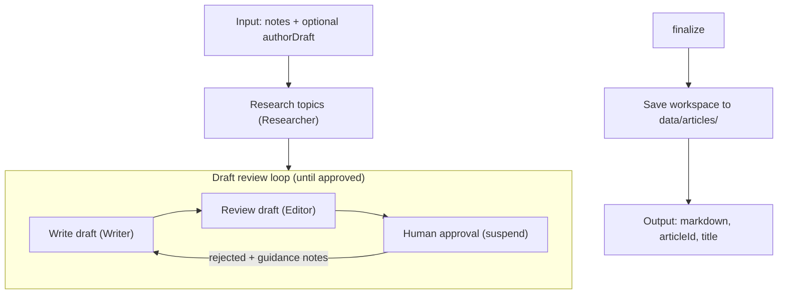
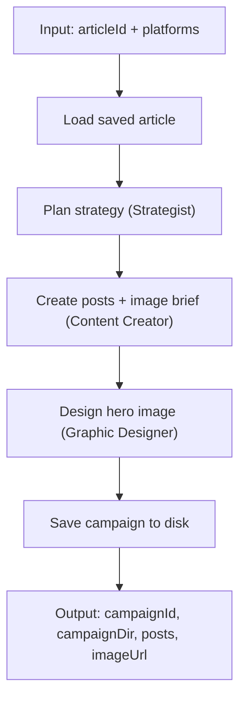

# Workflows

Two Mastra workflows orchestrate the agents. Run the article workflow first, then feed its Markdown output into the social media workflow. Source files live in `src/mastra/workflows/`.

You can also start and resume these workflows (and read articles/campaigns) via the MCP server — see [mcp.md](mcp.md).

| Workflow | ID | Source |
|----------|-----|--------|
| Article workflow | `article-workflow` | `src/mastra/workflows/article-workflow.ts` |
| Social media workflow | `social-media-workflow` | `src/mastra/workflows/social-media-workflow.ts` |

## Article workflow

The `articleWorkflow` turns author operating instructions (`notes`) and an optional author draft into a human-approved Markdown article.

### Steps

1. **Research** — if the operating instructions contain URLs, the workflow fetches each page and the Researcher summarizes only that material (no web search). Otherwise the Researcher extracts topics from the instructions and researches them online (including social media/forums). Notes are treated as instructions, not article body.
2. **Write** — the Writer drafts the article as Markdown from the research brief, following the operating instructions. When `authorDraft` is provided, that prose is the starting point to develop.
3. **Review** — the Editor reviews the draft against instruction intent, research, and (when present) the author draft.
4. **Approve** — the workflow suspends for human approval; the human approves or rejects with additional operating instructions.
5. Steps 2–4 repeat, feeding the editor's review and the human's guidance back to the Writer, until the human approves.
6. The approved draft is saved as `approved.md` inside a per-run article folder under `data/articles/`, with numbered drafts and editor reviews preserved in `drafts/`. Resume suspended runs in Studio to continue reviewing an in-progress article later.

### Article workspace

Each workflow run creates a folder (snake_case title + short id). Files are written incrementally:

| When | Written |
|------|---------|
| Research done | `notes.md`, `author-draft.md` (only if provided), `research-brief.md`, `article.json` |
| Writer done | `drafts/00N.md` (clean H1; revision via filename and `article.json` `currentDraft`) |
| Editor done | `drafts/00N.editor-review.md` |
| Human rejects | `drafts/00N.human-notes.md`, status → `in_progress` |
| Human approves | `approved.md`, status → `approved` |

While status is `awaiting_review`, resume the suspended workflow run in Studio. See [customization.md](customization.md) for the full folder layout.

### Input and output

**Input:** `{ notes: string, authorDraft?: string }`

- `notes` — operating instructions (article type, topics, sources/URLs, constraints). Never article body.
- `authorDraft` — optional author-written prose or outline that belongs in the article.

**Output:** `{ markdown: string, articleId: string, title: string }`

### Agents

Researcher → Writer → Editor (looping until human approval).

## Social media workflow

The `socialMediaWorkflow` loads a saved article from `data/articles/` and saves a social campaign to disk.

### Steps

1. **Load** — reads the selected article from `data/articles/` (dropdown in Studio).
2. **Strategize** — the Strategist decides a publication strategy: a hook/angle, call to action, and timing guidance for each requested platform.
3. **Create** — the Content Creator writes a platform-native post for every requested platform and an abstract, evocative creative brief for the hero image (no charts or text).
4. **Design** — the Graphic Designer executes that brief into one on-brand abstract hero image.
5. **Save** — writes the campaign under `data/articles/{articleId}/social/{campaignId}/` (posts, strategy, image brief, hero image metadata). No human approval step; review and publish manually from disk.

### Input and output

**Input:** `{ articleId: string, platforms: string[], articleUrl?: string }` (see `SUPPORTED_PLATFORMS` in `src/mastra/config/platforms.ts`)

- `articleId` — saved article from `data/articles/` (Studio dropdown; run the article workflow first)
- `platforms` — target social platforms
- `articleUrl` (optional) — published URL for post CTAs and Dub link shortening

**Output:** `{ campaignId: string, campaignDir: string, posts: Array<{ platform, text, hashtags? }>, imageUrl?: string }`

### Environment and integrations

- **`PUBLIC_BASE_URL`** — base URL for locally generated hero images. Defaults to `http://localhost:4111`.
- **`DUB_API_KEY`** (optional) — when `articleUrl` is provided, the Content Creator shortens it via [Dub's MCP server](https://dub.co) before writing posts.
- **Buffer** — not used by the workflow for now. `BUFFER_API_KEY` and `buffer-mcp-client.ts` remain in the repo for a future publish step.

### Who this content is for

All agents read your profile from `src/mastra/config/user-profile.local.json` when present (see [customization.md](customization.md)).

### Agents

Strategist → Content Creator → Graphic Designer → save to disk.
